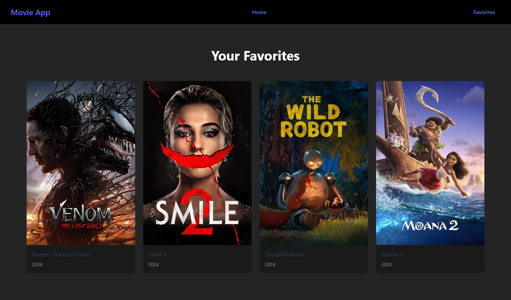

# Movie App

This is a React-based movie application that allows users to search for movies, view popular movies, and save their favorite movies. The app integrates with The Movie Database (TMDb) API to fetch movie data.
You can try the live version here: [Live App](https://movie-list-5venn7ynd-elfdrkns-projects.vercel.app/)
## Features

- **Search for Movies**: Search for movies by name and view the results.
- **Popular Movies**: View a list of popular movies.
- **Favorites**: Save your favorite movies and view them on a separate page.


## Technologies Used

- React
- React Router for navigation
- The Movie Database (TMDb) API for movie data
- React Context API for managing the state of favorite movies
- CSS for styling

## Getting Started

### Prerequisites

Make sure you have `Node.js` and `npm` installed on your machine.

### Installation

1. Clone this repository:

   ```bash
   git clone https://github.com/elfdrkn/MovieList.git
2. Navigate to the project directory:

    cd movie-app
3. Install the dependencies:
    npm install
4. Start the development server:
    npm start
    The app will be available at http://localhost:3000.

### Usage
Home Page: On the home page, you can search for movies or view a list of popular movies.
Favorites Page: On the favorites page, you can see all your favorite movies.

### API
This app uses The Movie Database (TMDb) API to fetch movie data. You can learn more about the API and get your own API key: https://www.themoviedb.org/

### Screenshot




